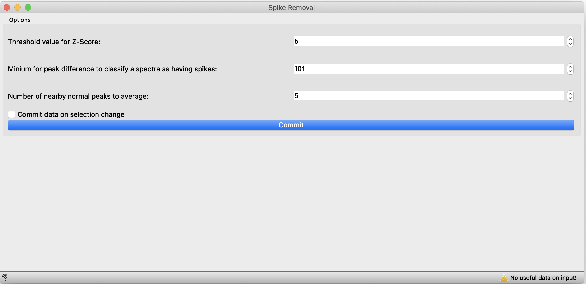

# Spike Removal

**Inputs**

- Data: input dataset

**Outputs**

- Processed: Despiked dataset

The **Spike Removal** widget enables you to remove anaomylous spiked data from ramen spectra. It achieves this in a two part method. First, since spiked data is generally significantly larger than the normal spectra, it finds spectra in the dataset which are exhibit these vast difference. Second, using a z scores method it sets a limit for these spike spectra in order to find the areas within the spectra which are spikes and replacing them with an average of nearby data.

Below is a description of the inputs for the **Spike Removal** tool

1. Threshold is used to determine a cutoff value within a spectra for determining peaks
2. The minimum peak difference is used to find spectras within a data set which display a high contrast between peaks as observed in spiked spectra.
3. The nearby peaks setting is used to determine the range over which the peak will average non spiked data points. 
